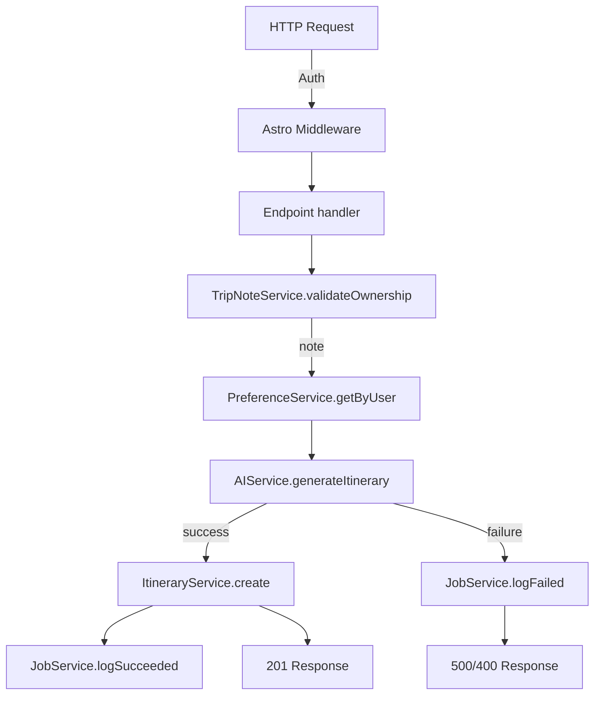

# API Endpoint Implementation Plan: Generate Itinerary (`POST /api/trip-notes/generateItenerary`)

## 1. Endpoint Overview
Generate a travel itinerary for an existing trip note. The endpoint:
1. Ensures the trip note exists and belongs to the authenticated user.
2. Validate passed values and upsert the travel_note object in db.
2. Retrieves the user’s saved preferences (if any).
3. Calls the AI service with note + preferences to obtain an itinerary.
4. Persists the itinerary and logs an `ai_generation_job` record (status *succeeded* or *failed*).
5. Returns the newly-created itinerary (DTO) on success, or a structured error on failure.

## 2. Request Details
- **HTTP Method:** `POST`
- **URL:** `/api/trip-notes/generateItenerary`
- **Authentication:** Supabase session (middleware injects `locals.supabase` + `locals.user`).
- **Headers:** `Content-Type: application/json`
- **Body (CreateTripNoteCommand + id):**
  ```json
  {
    "id": 42,
    "destination": "Tokyo, Japan",
    "earliestStartDate": "2026-03-10",
    "latestStartDate": "2026-03-15",
    "groupSize": 4,
    "approximateTripLength": 7,
    "budgetAmount": 2500,
    "currency": "USD",
    "details": "Cherry blossom season!"
  }
  ```

### 2.1 Parameters
- **Required**
  - `id` – bigint, existing `trip_notes.id`.
- **Optional**
  - Remaining trip-note fields. If provided and they differ from the stored record **after validation**, the service will **upsert** (i.e. update) those columns in `trip_notes` before proceeding.

## 3. Used Types
- `CreateTripNoteCommand` (request body shape without `id`, extended with `id`).
- `TripNoteEntity` (DB row).
- `TripNoteDTO` (internal mapping for AI prompt).
- `UserPreferenceDTO[]` (to AI prompt).
- `ItineraryDTO` (response payload).
- `GenerationJobEntity` (DB row).

## 4. Response Details
| Scenario | Status | Body |
|----------|--------|------|
| Success | **201 Created** | `ItineraryDTO` |
| Validation error | 400 | `{ error: "message" }` |
| Unauthorized | 401 | `{ error: "unauthorized" }` |
| Trip note not found (id not owned by user) | 404 | `{ error: "not_found" }` |
| AI failure or internal error | 500 | `{ error: "message" }` |

## 5. Data Flow


### 5.1 Services & Responsibilities
| Service | Responsibilities |
|---------|------------------|
| **TripNoteService** | `findById`, `assertBelongsToUser`, `updateIfChanged`, `toPromptDTO` |
| **PreferenceService** | `listByUser(userId)` |
| **AIService** | Build prompt, call OpenRouter, measure duration, return itinerary text |
| **ItineraryService** | `create({ tripNoteId, text, suggestedTripLength })` |
| **JobService** | `log({ status, tripNoteId, durationMs?, errorText? })` |

All new services live in `src/lib/services/*` and expose typed functions.

## 6. Security Considerations
1. **Authentication**: Require valid Supabase JWT; reject otherwise (401).
2. **Authorization**: Verify `trip_notes.user_id === authUser.id` before processing (404 for non-owned note).
3. **Input Validation**: Zod schema; numeric > 0; dates ISO; currency `[A-Z]{3}`.
4. **Data Consistency & Upsert**: Validate incoming fields (destination, dates, groupSize, etc.). If they differ from DB, update the record in-place using a transactional upsert before generating the itinerary; this removes the previous 400-error path.

## 7. Error Handling
| Case | Status | Job Record | Notes |
|------|--------|-----------|-------|
| Invalid body (Zod) | 400 | none | Early return |
| Trip note not found / not owned | 404 | none | |
| Preferences fetch error | 500 | failed | Log error_text |
| AI timeout / error | 500 | failed | Capture message, duration_ms NULL |
| Itinerary insert fail | 500 | failed | Rollback insert if applicable |
| Job logging fail | 500 | — | Respond 500, log server error |

All server errors logged via `console.error` + structured logger (e.g., `pino`) and stored in `ai_generation_jobs`.

## 8. Performance Considerations
- **AI call**: Potentially 20-60 s latency. Measure and store `duration_ms`.
- **Timeouts**: Configure fetch timeout (e.g., 90 s) to avoid hanging requests.

## 9. Implementation Steps
1. **Define Zod Schema** in `src/lib/schemas/tripNoteGenerateItinerary.schema.ts` extending `CreateTripNoteCommand` with required `id`.
2. **Create Services**
   - `TripNoteService` – `findById`, `assertBelongsToUser`, `toPromptDTO`.
   - `PreferenceService` – `listByUser`.
   - `AIService` – uses `fetch` to POST to OpenRouter, returns `{ itinerary, durationMs }`.
   - `ItineraryService` – inserts into `itineraries` table, returns `ItineraryDTO`.
   - `JobService` – inserts into `ai_generation_jobs`.
3. **API Route** `src/pages/api/trip-notes/generateItenerary.ts` (Astro server endpoint):
   1. `export const prerender = false;`  // dynamic route
   2. Parse & validate body with Zod; return 400 on error.
   3. Get `supabase` + `user` from `locals`.
   4. Load trip note; 404 if not found/unauthorized.
   5. If body includes other fields, compare vs DB → **call `TripNoteService.updateIfChanged`** to upsert validated differences.
   6. Fetch user preferences.
   7. Start timer; call `AIService.generateItinerary(updatedNoteDTO, prefs)` inside try/catch.
   8. On success:
      - Insert itinerary; commit.
      - Log job *succeeded* with duration.
      - Return 201 with `ItineraryDTO`.
   8. On failure:
      - Log job *failed* with error text.
      - Return 500 with error message.
4. **Unit Tests** (`vitest`):
   - Validation schema edge cases.
   - Service logic with mocked Supabase & AI.
   - Endpoint integration happy path & failures.
5. **Update Shared Types** if needed (none anticipated).
6. **Docs**: Ensure OpenAPI / README updated (post-implementation).
7. **CI**: Add tests & linting; ensure new files pass `pnpm lint`, `pnpm test`.

